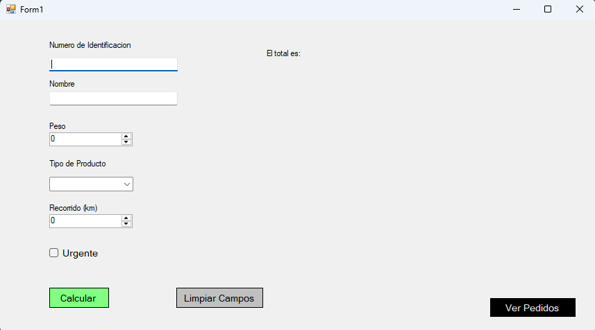
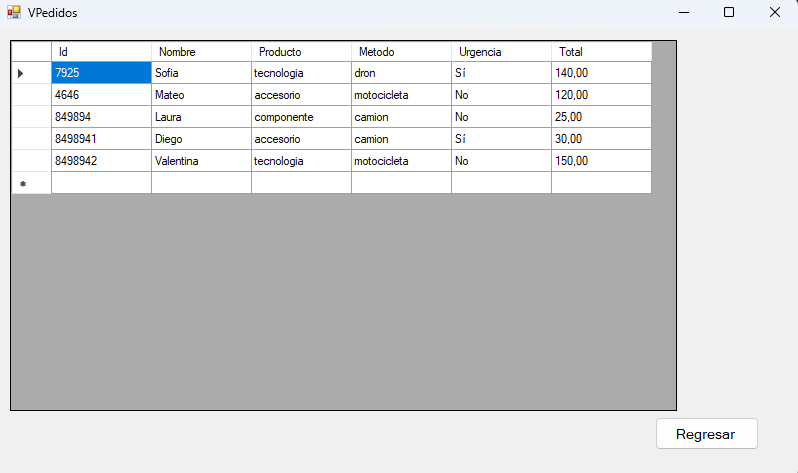
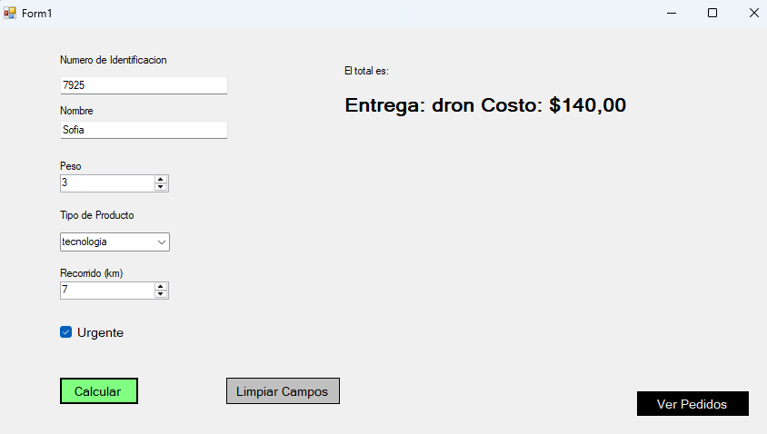
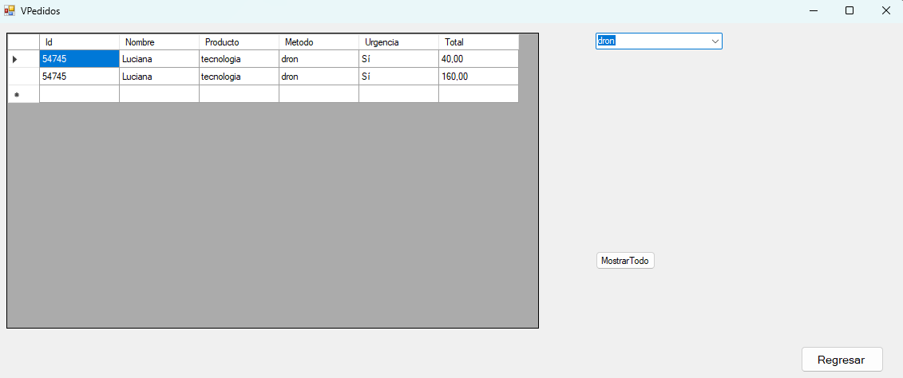
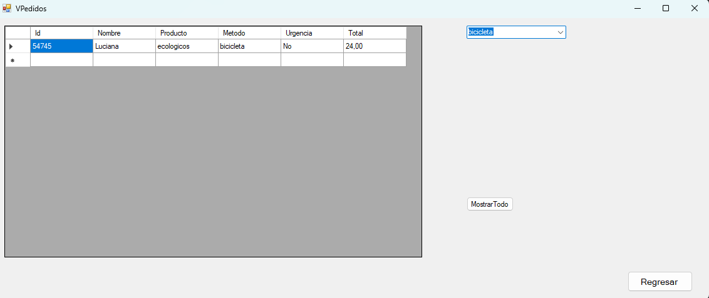
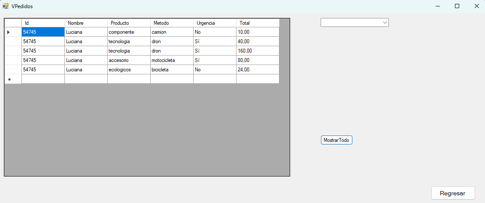

# PedidosApp
**PedidosApp** es una aplicación de escritorio desarrollada en C# con Windows Forms que automatiza la gestión de entregas en una tienda virtual. Aplica principios de programación orientada a objetos (POO), SOLID y patrones de diseño como Strategy, Factory Method y Singleton.

---

## 🚀 Funcionalidades

- Registro de pedidos con datos del cliente, producto, urgencia, peso y distancia.
- Asignación automática del método de entrega basado en reglas de negocio.
- Cálculo de costos según el tipo de transporte.
- Registro centralizado de pedidos (Singleton).
- Interfaz visual para ver y limpiar los campos para hacer pedidos.

---

## 🧠 Lógica de Entregas

- **Tecnología + Urgente** → Dron (20 x km)
- **Accesorio** → Motocicleta (10 x km)
- **Componente** o **peso > 10kg** → Camión (5 x km)
- Casos no cubiertos → Motocicleta por defecto

---

## 🖼️ Capturas de pantalla

### Capturas Vista Forms


### Resultado de un pedido


### Nuevas Categorías

### Resultados de Filtros





##Nuevos Resultados


---

## 🎥 Video demostracion

[Ver en Google Drive](https://drive.google.com/file/d/1w7eHbuTlBiWV95UDwVHBB34FJiuzdhLd/view?usp=sharing)

---
## 📁 Estructura del Proyecto

```plaintext
PedidosApp/
├── Clases
    ├──  EntregaMoto.cs
    ├──  EntregaDron.cs
    ├──  EntregaCamion.cs
    ├── Pedidos.cs
    └── RegistroPedido.cs
├── Factory
   └──EntregaFactory.cs
├──Listado
    └──Productos.cs
├── CalcularPedidos.cs
├── VPedidos.cs
├── README.md
└── Capturas/
    ├── Evaluando1.png
    ├── Evaluando2.png
    ├── VisualizacionPedidos.png
    └── VistaFormulario.png


